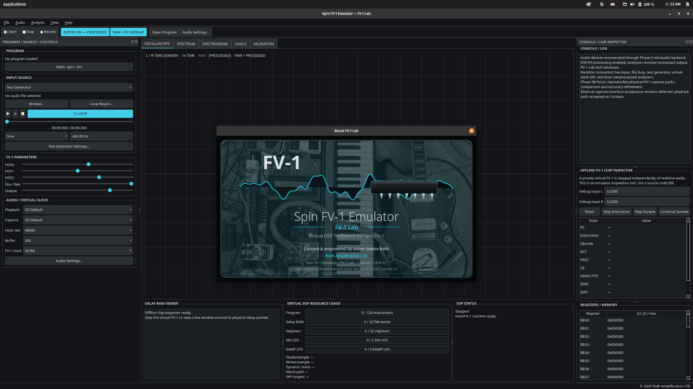
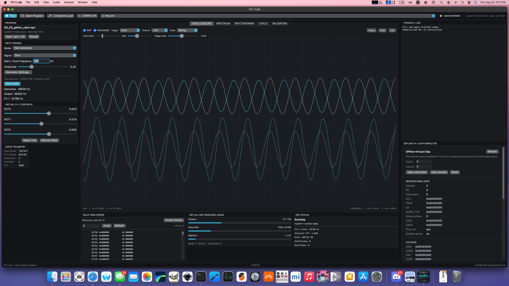
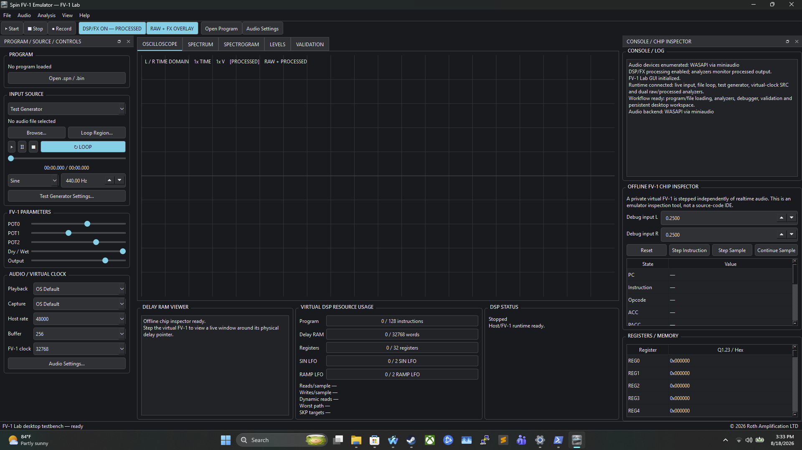
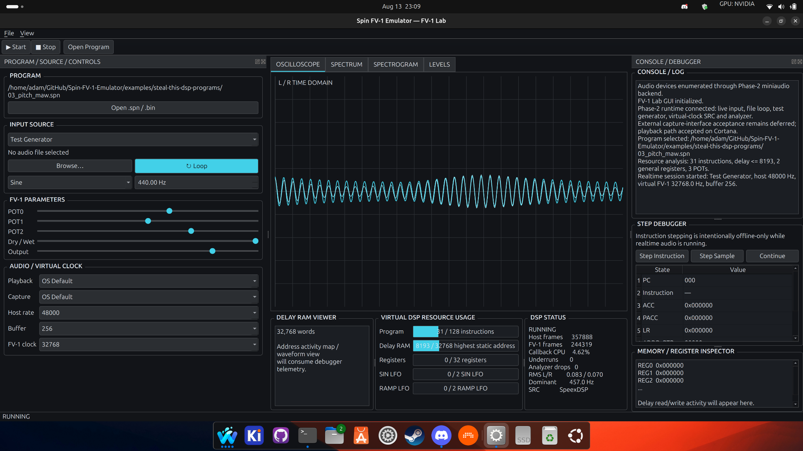

# Spin FV-1 Emulator

Open-source tools for emulating, measuring and inspecting the Spin Semiconductor
FV-1 DSP.

**Current release: FV-1 Lab 1.0.0 (`v1.0.0`).** The standalone desktop line
is complete on Linux, macOS and Windows. The immutable release tag points to
commit `6bcab5966d71520a7321178f116352b3ad347fef`. The release closes desktop
porting without changing the locked FV-1 execution model or public FV1SDK ABI.

The product is intentionally a polished standalone virtual FV-1 and DSP lab
instrument, not a full source-code IDE. A future dedicated IDE can consume the
public FV1SDK without turning this application into a source editor.

The virtual FV-1 remains independent of GUI toolkit, audio-device framework and
operating system. Linux and Windows share the same Qt 6 Widgets FV-1 Lab
frontend; macOS uses a native SwiftUI frontend. Platform work must not
destabilize the FV-1 execution model or public SDK ABI.

## Current desktop status

FV-1 Lab is now a cross-platform standalone FV-1 emulator/testbench.

| Platform | Frontend | Status |
|---|---|---|
| Linux | Qt 6 Widgets | **1.0 desktop line complete; reference implementation** |
| macOS | Native SwiftUI | **1.0 desktop line complete; Phase 8D** |
| Windows 11 | Same Qt 6 Widgets frontend as Linux | **1.0.0 released; Phase 9C complete** |

Current roadmap: [`docs/ROADMAP.md`](docs/ROADMAP.md)

Platform snapshot: [`docs/PLATFORM-STATUS.md`](docs/PLATFORM-STATUS.md)

1.0 release record: [`docs/RELEASE-STATUS-1.0.0.md`](docs/RELEASE-STATUS-1.0.0.md)

Post-1.0 roadmap: [`docs/POST-1.0-ROADMAP.md`](docs/POST-1.0-ROADMAP.md)

## FV-1 Lab on Linux, macOS and Windows

| Linux | macOS | Windows |
|---|---|---|
|  |  |  |

Screenshot standards/provenance:
[`docs/GUI-SCREENSHOTS.md`](docs/GUI-SCREENSHOTS.md)

## Phase 1 status

Complete and regression-tested:

- `libfv1-core` C++20 production engine with a legacy low-level C API
- 128-word / 512-byte external FV-1 program loading
- predecoded instruction representation for the realtime execution path
- signed 24-bit saturating datapath
- ACC, PACC, LR and the FV-1 register bank
- 9-bit POT input quantization
- 32K circular delay memory
- sine/cosine and ramp LFO state
- RDA, RMPA, WRA, WRAP, RDAX, RDFX/LDAX, WRAX, WRHX, WRLX, MAXX/ABSA, MULX, LOG, EXP, SOF, AND/CLR, OR, XOR/NOT, SKP/NOP, WLDS, WLDR, JAM and CHO execution paths
- instruction-level sample stepping and state snapshots
- static program resource analysis
- SpinASM-compatible assembler integration
- `.spn`, 512-byte `.bin`, 4 KiB bank and Intel HEX program loading through `fv1-cli`
- deterministic offline WAV rendering at the configured virtual FV-1 rate
- Linux CMake/CTest build and regression suite

The repository also carries the eight **Steal This DSP** factory programs as non-authoritative regression/examples so the emulator is continuously exercised with real effects rather than only synthetic opcodes. The bundled demo names track the current factory bank:

| Slot | Demo program |
|---:|---|
| 0 | **55 Gallon Saint** |
| 1 | **Last Known Copy** |
| 2 | **Ghost Spring** |
| 3 | **Gravity Clerk** |
| 4 | **Cold Case** |
| 5 | **Municipal Lung** |
| 6 | **Reverse Witness** |
| 7 | **Data Felon** |


## Phase 2 status

Implemented in the current Linux bring-up:

- `libfv1-runtime` with an explicit host-rate / virtual-FV-1-rate clock bridge
- SpeexDSP production SRC when available, plus a deterministic linear fallback for stripped-down build environments
- interchangeable `LiveInputSource`, `FileLoopSource`, and `TestSignalSource` implementations
- loopable WAV input with independent file and audio-device sample rates, including PCM/float and standard WAVE_FORMAT_EXTENSIBLE PCM/float subtypes
- sine, logarithmic sweep, white-noise, pink-noise, and repeating-impulse test generators
- `libfv1-analysis` background worker with a lock-free SPSC audio queue
- peak, RMS, stereo correlation, FFT spectrum, and dominant-frequency telemetry
- Linux `libfv1-audio` / miniaudio device backend
- `fv1-live devices` device enumeration
- `fv1-live run` for live capture, file-loop, or generated-stimulus sessions
- callback CPU-load, runtime underrun, and analyzer-drop counters
- `fv1-cli render` now accepts host WAV rates that differ from the virtual FV-1 rate
- automated 48 kHz host -> 32.768 kHz virtual FV-1 clock-domain regression
- fractional virtual-clock preservation for crystal-derived rates such as 46.6084 kHz

The audio-device backend began Linux-first. Generator/file-loop playback, production SpeexDSP clock bridging, analyzer telemetry and real miniaudio playback were accepted there before the native Apple and Windows products were built. The 1.0 desktop line now carries the same virtual-chip/runtime contracts through Linux, native macOS and Windows frontends; physical FV-1 silicon validation remains the separate deferred fidelity gate.

## Easy Linux build, launch and packages

The finished Linux FV-1 Lab can be built, launched and packaged through one helper:

```bash
./linux.sh deps          # first-time prerequisites
./linux.sh run           # build + launch native app
./linux.sh test          # full regression suite
./linux.sh package all   # .deb + AppImage + Flatpak -> dist/
```

Individual packages are available with `./linux.sh package deb`,
`./linux.sh package appimage`, and `./linux.sh package flatpak`. See
[`docs/LINUX-PACKAGING.md`](docs/LINUX-PACKAGING.md) for details.

## Build on Linux

Requirements:

- CMake 3.20+
- Ninja
- GCC or Clang with C++20 support
- Python 3 for development/regression tests (the installed app/SDK compiles SpinASM natively)
- `libspeexdsp-dev` for production realtime SRC
- a pinned miniaudio header installed automatically by `bootstrap-dev.sh` for Linux device I/O
- Qt 6 Widgets development packages (`qt6-base-dev`, `qt6-base-dev-tools`) for `fv1-lab`

```bash
sudo apt install build-essential cmake ninja-build python3 pkg-config curl libspeexdsp-dev qt6-base-dev qt6-base-dev-tools

git clone https://github.com/Roth-Amplification-Ltd/Spin-FV-1-Emulator.git
cd Spin-FV-1-Emulator
make test
```

Or directly:

```bash
cmake -S . -B build -G Ninja -DCMAKE_BUILD_TYPE=RelWithDebInfo
cmake --build build
ctest --test-dir build --output-on-failure
```

## `fv1-cli`

Compile a SpinASM program:

```bash
./build/fv1-cli assemble effect.spn effect.bin
```

Inspect virtual DSP resource usage:

```bash
./build/fv1-cli inspect effect.spn
```

Step through one virtual sample instruction by instruction:

```bash
./build/fv1-cli step effect.spn \
  --in-l 0.25 --in-r -0.10 \
  --pot0 0.50 --pot1 0.70 --pot2 0.30
```

Render a WAV file offline:

```bash
./build/fv1-cli render effect.spn input-32768.wav output.wav \
  --pot0 0.50 --pot1 0.50 --pot2 0.50
```

Phase 2 removes that restriction: the WAV/device host rate and virtual FV-1 rate are independent. For example, a 48 kHz WAV can be rendered through an FV-1 clocked at 32.768 kHz without changing the file duration or the virtual effect timing.


## `fv1-live`

Enumerate Linux audio devices:

```bash
./build/fv1-live devices
```

Process a live interface input through Gravity Clerk:

```bash
./build/fv1-live run examples/steal-this-dsp-programs/03_gravity_clerk.spn \
  --live --input-device 0 --output-device 0 \
  --host-rate 48000 --buffer 256 --clock 32768 \
  --pot0 0.60 --pot1 0.50 --pot2 0.70
```

Loop an imported WAV through the exact same FV-1 runtime:

```bash
./build/fv1-live run examples/steal-this-dsp-programs/03_gravity_clerk.spn \
  --file ~/Music/fv1-test.wav --loop-start 0 --loop-end 8 \
  --host-rate 48000 --buffer 256 --clock 32768 \
  --seconds 20 --meter
```

Generate a deterministic test stimulus without a capture device:

```bash
./build/fv1-live run examples/simple_passthrough.spn \
  --sine 440 --host-rate 48000 --clock 32768 --seconds 5 --meter
```

See `docs/PHASE2-LINUX-TEST-PLAN.md` for the full Cortana bring-up sequence.

## Resource analyzer

`fv1-cli inspect` currently reports:

- program words used / 128
- worst-case forward-SKP instruction path
- static and dynamic delay reads
- static delay writes
- highest statically referenced delay address
- general register usage
- POT usage
- SIN/COS LFO usage
- RAMP LFO usage
- SKP count
- opcode histogram

These values feed the **Virtual DSP Resource Usage** panel in the Qt testbench.

## Debugger API

The core exposes two execution styles:

1. normal block/sample processing;
2. instruction-step mode for the future debugger.

The debugger can begin a virtual audio sample, execute one FV-1 instruction at a time, inspect ACC/PACC/LR/register/LFO state, observe SKP branches, and then retrieve the completed stereo DAC sample.


## Phase 5A validation framework — complete

Phase 5A adds a reusable, GUI-independent `libfv1-validation` layer so emulator output can be
compared numerically with a later physical FV-1 capture without changing the measurement code.

Current capabilities:

- deterministic multitone, sweep, sine, white/pink-noise and impulse validation WAV generation;
- automatic reference/capture time alignment and latency reporting;
- raw gain error plus optional residual-only gain matching;
- per-channel correlation, residual RMS/peak and SNR;
- magnitude-error and phase-error measurements on active FFT bins;
- configurable PASS/FAIL thresholds;
- JSON, Markdown, frequency-CSV and residual-WAV report bundles;
- `fv1-cli stimulus` and `fv1-cli validate`;
- an offline **VALIDATION** tab in FV-1 Lab;
- four switchable FV-1 Emulator icons (Silver, Dark Cyan, Blue, Amber) and Linux desktop metadata.

Generate a deterministic lab stimulus:

```bash
./build/fv1-cli stimulus /tmp/fv1-validation.wav \
  --kind multitone --seconds 5 --host-rate 48000 --level 0.25
```

Compare a virtual reference with a capture:

```bash
./build/fv1-cli validate virtual.wav hardware-capture.wav \
  --max-lag-ms 100 --gain-match \
  --report-prefix /tmp/fv1-validation-report
```

See [`docs/PHASE5-VALIDATION.md`](docs/PHASE5-VALIDATION.md) and
[`docs/PHASE5-LINUX-TEST-PLAN.md`](docs/PHASE5-LINUX-TEST-PLAN.md).


## Phase 5B hardware-validation workflow

Phase 5B keeps the standalone FV-1 testbench identity while preparing reproducible physical-chip
measurement. The GUI now includes **File → Paste SpinASM…** for quickly compiling/pasting one
program without creating a source file, plus a software-rendered startup splash with actual startup
progress milestones. The splash uses a dedicated standalone FV-1/waveform/DIP composition rather
than reusing the application icon and renders `assets/splash/FV1LabSplashImagebase.png` as its
full-bleed photographic background. The startup presentation includes project/author/license credits,
and the same branded artwork can be reopened after launch from **Help → About FV-1 Lab…** with
version and license information. The VALIDATION tab can generate a deterministic hardware test pack containing
impulse, multitone, sweep, 1 kHz sine, white-noise and pink-noise WAVs together with a JSON manifest.

Generate the same pack headlessly:

```bash
./build/fv1-cli validation-pack /tmp/fv1-hardware-pack \
  --host-rate 48000 --seconds 5 --level 0.25
```

The physical FV-1 board and capture interface remain the final Phase-5B acceptance gate; the
software does not claim silicon-equivalent accuracy until those measurements are performed.

See [`docs/PHASE5B-HARDWARE-VALIDATION.md`](docs/PHASE5B-HARDWARE-VALIDATION.md) and [`docs/PHASE5B-LINUX-TEST-PLAN.md`](docs/PHASE5B-LINUX-TEST-PLAN.md).

## Phase 5C model hardening and conformance

Phase 5C leaves the finished Qt testbench alone and strengthens the virtual machine underneath it.
The project now builds an intentionally independent `fv1-reference` implementation plus an
`fv1-conformance` harness that runs the production and reference engines against identical
deterministic inputs and compares state after every executed instruction.

```bash
./build/fv1-cli conformance \
  examples/steal-this-dsp-programs/00_55_gallon_saint.spn \
  --samples 256 --seed 0x4656315c2026
```

Phase 5C also adds explicit virtual sample/instruction coordinates, canonical state/delay digests,
numeric/time/quantization boundary tests, randomized differential programs, all-eight-demo
conformance, and an optional Clang/libFuzzer + ASan/UBSan target. The normal headless suite is now
18 tests; a Qt-enabled build adds the FV-1 Lab smoke test.

Differential agreement is deliberately described as **conformance to the current Hardware Emulation
Contract**, not proof of undocumented silicon behavior. Physical FV-1 closure remains deferred.

See [`docs/HARDWARE-EMULATION-CONTRACT.md`](docs/HARDWARE-EMULATION-CONTRACT.md),
[`docs/PHASE5C-MODEL-HARDENING.md`](docs/PHASE5C-MODEL-HARDENING.md), and
[`docs/FV1-INSTRUCTION-CONFORMANCE.md`](docs/FV1-INSTRUCTION-CONFORMANCE.md).

## Phase 6B cross-language SDK stabilization

Phase 6A extracted the virtual chip into an installable module. Phase 6B now proves that module from
outside the application and fills the capability gaps needed by native Windows/macOS clients, a
future IDE, and unrelated third-party hosts **before** any ABI freeze.

The binary contract remains the C ABI in `<fv1/sdk.h>` with optional debugger/introspection functions
in `<fv1/sdk_debug.h>`. A header-only `<fv1/sdk.hpp>` convenience wrapper is provided for C++, and an
installed Clang `module.modulemap` makes the same C ABI directly importable from Swift/Objective-C.

The candidate now includes version/capability discovery, opaque engine lifetime, program load and
readback, native SpinASM compilation, single/all POT updates, single-sample and block float
processing, snapshots, delay inspection, resource analysis, and optional instruction stepping/state
digests. Host audio devices, host-rate SRC, UI toolkits, plotting, settings and file dialogs remain
outside the virtual-chip ABI.

For native frontend and third-party integration work, configure the **SDK-only** build:

```bash
cmake -S . -B build-sdk -G Ninja \
  -DFV1_SDK_ONLY=ON \
  -DFV1_BUILD_TESTS=ON
cmake --build build-sdk
ctest --test-dir build-sdk --output-on-failure
cmake --install build-sdk --prefix /tmp/fv1-sdk
```

`FV1_SDK_ONLY=ON` does not discover or build Qt, miniaudio, SpeexDSP, `fv1-runtime`, analysis,
validation, or the Linux application. The staged development surface contains only the public SDK
headers/module map, `FV1SDK::sdk` package metadata, and the SDK library; private project headers are
not installed as SDK headers.

Cross-language proving hosts live under `examples/sdk-hosts/` for C++, Python `ctypes`, Swift, Rust
FFI and Objective-C; `examples/sdk-host/` remains the smallest pure-C CMake consumer. The normal
headless suite is **27 tests** in Phase 6B, while the SDK-only shared suite is **7 tests** and the
self-contained static SDK suite is **5 tests**. A Qt-enabled workstation adds the FV-1 Lab smoke
test.

The ABI is still **not frozen**. See
[`docs/SDK-CONSUMER-REQUIREMENTS.md`](docs/SDK-CONSUMER-REQUIREMENTS.md),
[`docs/SDK-CROSS-LANGUAGE.md`](docs/SDK-CROSS-LANGUAGE.md),
[`docs/SDK-ABI-POLICY.md`](docs/SDK-ABI-POLICY.md), and
[`docs/PHASE6B-SDK-STABILIZATION.md`](docs/PHASE6B-SDK-STABILIZATION.md).

## Fidelity policy

The project aims for hardware-oriented emulation, but Phase 1 does **not** claim bit-exact FV-1 equivalence yet.

Known fidelity items reserved for hardware/reference validation include:

- exact proprietary delay-RAM floating-point representation;
- final CHO LFO address/fraction bit partition and corner cases;
- exhaustive LOG/EXP edge behavior;
- analog ADC/DAC filtering and converter latency;
- POT hysteresis around code boundaries.

The default `FV1_DELAY_REFERENCE_16` mode intentionally reduces delay-memory precision. A `FV1_DELAY_FULL_24` diagnostic mode is provided to separate algorithm behavior from that approximation.

That distinction is deliberate: unknown hardware details stay labeled as unknown instead of being presented as fake precision.

## Audio sources are a first-class runtime subsystem

Phase 2 makes the same virtual-FV-1 processing path accept three interchangeable sources:

- **live audio interface input**;
- **imported audio-file playback with seamless looping and loop-region controls**;
- deterministic **test generators** such as impulse, sine, sweep and noise.

The future GUI can therefore reuse these same runtime objects to repeatedly loop a guitar/drum/etc. recording while an effect is edited and debugged, or process a live instrument through the audio interface.

See [`docs/ROADMAP.md`](docs/ROADMAP.md) and [`docs/ARCHITECTURE.md`](docs/ARCHITECTURE.md).


## Phase 4 emulator/testbench

Phase 4 preserves the accepted Phase-3 dashboard and makes it a deeper virtual instrument rather than replacing it with an IDE.

Highlights include:

- simultaneous **raw input + processed FV-1** scope/spectrum overlays;
- oscilloscope time zoom, vertical gain, Auto/Normal/Single trigger, source/slope/level controls, freeze and single-shot re-arm;
- spectrum log/linear frequency modes, dB-range controls, peak hold and interpolated dominant-frequency reporting;
- configurable spectrogram history;
- WAV loop play/pause/stop/seek, loop-region selection and loop-boundary crossfade;
- expanded sine/sweep/noise/impulse generator settings;
- realtime-safe raw/processed WAV recording through a background writer;
- plot copy/save and CSV export;
- reusable GUI-independent `fv1-debugger` plus the right-side **offline virtual-chip inspector**;
- REG0–31 and Delay RAM inspection;
- the existing resource/status panels expanded for testbench use;
- permanent `© 2026 Roth Amplification LTD` footer.

The offline inspector owns a private FV-1 engine, so instruction/sample stepping never races the realtime audio callback. It is intentionally a chip-inspection feature rather than a full source editor/project environment.

See [`docs/PHASE4-TESTBENCH.md`](docs/PHASE4-TESTBENCH.md) and [`docs/PHASE4-LINUX-TEST-PLAN.md`](docs/PHASE4-LINUX-TEST-PLAN.md).

## License

Mozilla Public License 2.0. See [`LICENSE`](LICENSE).


## One-command development setup

On a fresh Pop!_OS/Ubuntu/Debian development machine, use the repository bootstrap first:

```bash
./bootstrap-dev.sh
```

It verifies/installs the Linux build environment, configures the project, builds it, and runs the test suite. Use `./bootstrap-dev.sh --check` to audit the environment without changing it. See `docs/DEVELOPMENT.md` for the project-wide bootstrap convention.


## Phase 3 desktop frontend

The repository includes the Qt 6 `fv1-lab` desktop frontend. On supported apt-based Linux hosts, `./bootstrap-dev.sh` installs Qt 6 development packages along with the Phase-2 audio dependencies. After building, launch it with:

```bash
./build/fv1-lab
```



[▶ Phase 3 Cortana runtime screencast (WebM)](docs/media/phase3-cortana-demo.webm)

The frontend follows the approved FV-1 Lab engineering layout and includes Dark, Light, Midnight, Amber CRT, Green Phosphor, Slate and High Contrast themes with independent accent selection. Start/Stop runs the existing Phase-2 audio/runtime engine for test-generator, looped-WAV, or live-input sources, while the DSP/audio libraries remain Qt-free.

Current GUI refinements include:

- a DAW-style **Audio → Audio Settings…** dialog for playback/capture device, host sample rate, period/buffer size, virtual FV-1 clock and SRC quality;
- persistent audio preferences via `QSettings`;
- a clearly labeled realtime **DSP/FX ON — PROCESSED / DSP/FX BYPASS — RAW** control;
- bypass monitoring that sends the raw selected source directly to output and the scope/analyzers without tearing down the audio device;
- useful right-click menus on analyzer plots, audio controls, program selection and the console;
- static resource analysis and live runtime telemetry in the approved dashboard layout.

See [`docs/PHASE3-GUI.md`](docs/PHASE3-GUI.md) and [`docs/PHASE3-ACCEPTANCE.md`](docs/PHASE3-ACCEPTANCE.md).

See also [`docs/SDK-ABI-CANDIDATE.md`](docs/SDK-ABI-CANDIDATE.md).

## Native Windows frontend (Phase 7A preview)

Phase 7A begins a native Win32 FV-1 Lab client that consumes only the installed/public FV-1 SDK
boundary. On Windows with Visual Studio/MSVC:

```powershell
cmake -S . -B build-win32 `
  -DFV1_BUILD_GUI=OFF `
  -DFV1_ENABLE_LIVE_AUDIO=OFF `
  -DFV1_BUILD_WINDOWS_FRONTEND=ON
cmake --build build-win32 --config RelWithDebInfo --target fv1-lab-win32
.\build-win32\RelWithDebInfo\fv1-lab-win32.exe
```

The Phase 7A shell provides native source/program loading, SDK compilation/control, virtual-chip
telemetry, a deterministic output scope, and WASAPI endpoint probing. Event-driven full-duplex WASAPI
streaming and Windows host↔FV-1 sample-rate conversion are intentionally reserved for Phase 7B.
See `docs/PHASE7A-WINDOWS-FRONTEND.md`.
