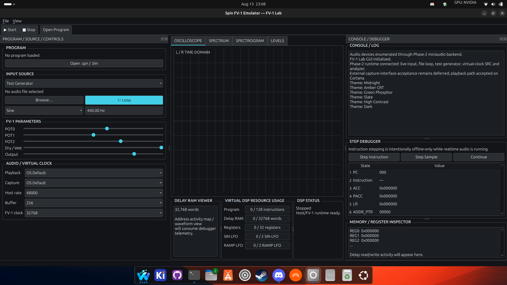

# Phase 3 Linux GUI Acceptance — Cortana

Date: 2026-08-13
Host: `Cortana`
Platform: Ubuntu 24.04 / Linux

## Accepted milestone

The first operational Qt FV-1 Lab frontend was built and exercised on Cortana against the real Linux Phase-2 dependency paths.

Observed tool/runtime stack during acceptance:

- GCC/G++ 13.3.0
- CMake 3.28.3
- Ninja 1.11.1
- Python 3.12.3
- SpeexDSP 1.2.1
- miniaudio 0.11.21
- Qt 6 Widgets 6.4.2

CMake reported both production audio paths and the GUI frontend enabled:

```text
Phase 2 SRC: SpeexDSP enabled
Phase 2 audio: miniaudio enabled from /usr/include
Phase 3 GUI: Qt 6.4.2 enabled
```

The original Phase-3 acceptance run passed all eight tests, including the offscreen Qt construction smoke test:

```text
fv1-core-tests            PASS
fv1-phase2-tests          PASS
compile-steal-this-bank   PASS
cli-inspect-pitch-maw     PASS
render-steal-this-bank    PASS
phase2-render-src         PASS
fv1-live-help             PASS
fv1-lab-smoke             PASS

100% tests passed
```

The current refinement adds a ninth `fv1-audio-host-tests` test covering the realtime DSP-bypass control API.

## Interactive GUI acceptance

The GUI was launched normally under the desktop session and exercised with the Steal This DSP `Pitch Maw` program.

Verified interactively:

- complete approved wide dashboard layout;
- program opening and SpinASM assembly;
- static FV-1 resource analysis;
- Test Generator session at a 48 kHz host rate with a 32.768 kHz virtual FV-1 clock;
- live oscilloscope rendering;
- live spectrum, spectrogram and levels telemetry;
- host/FV-1 frame counters and callback load;
- zero-underflow / zero-analyzer-drop operation during the captured run;
- theme switching and restoration;
- console/runtime status reporting;
- Qt dock/splitter layout behavior.

External capture/duplex-interface acceptance remains deferred because an external audio interface was not physically available during this session. This does not block Phase 3 GUI development.

## Recorded evidence

### Running Pitch Maw


### Initial dashboard/layout



### Short runtime capture

[Phase 3 Cortana runtime screencast (WebM)](media/phase3-cortana-demo.webm)

## Phase 3.1 refinement following acceptance

The first interactive run identified several usability improvements worth making before moving deeper into debugger tooling:

1. A DAW-style Audio Settings dialog for playback/capture device, host rate, buffer, virtual FV-1 clock and SRC quality.
2. A prominent DSP/FX bypass control that keeps the audio engine alive while exposing the raw source to both output and analyzers.
3. Explicit PROCESSED vs RAW analyzer labeling.
4. Task-local right-click context menus on plots, audio controls, program selection and the console.
5. Cleanup of the Qt double-to-float warnings observed during the acceptance build.

These are treated as Phase-3 usability refinements rather than a new architectural phase.
